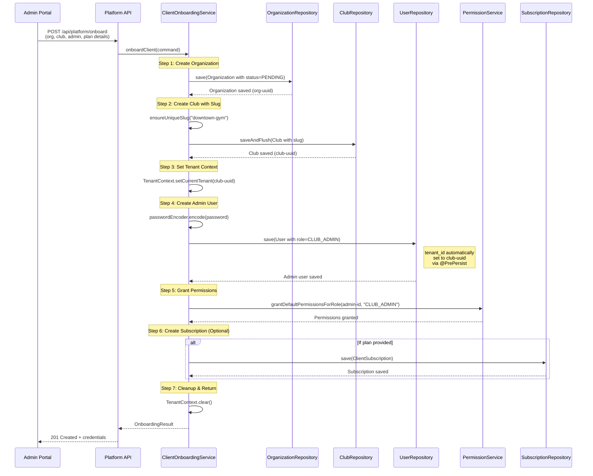

# Liyaqa Backend - Multi-Tenant Architecture

**Complete Guide to Tenant Isolation & Management**

**Project:** Liyaqa Gym Management System
**Version:** 1.0
**Last Updated:** 2026-02-04

---

## Table of Contents

1. [Executive Summary](#executive-summary)
2. [Architecture Overview](#architecture-overview)
3. [Tenant Identification Strategy](#tenant-identification-strategy)
4. [Data Isolation Approach](#data-isolation-approach)
5. [Tenant Context Management](#tenant-context-management)
6. [Hibernate Filters Implementation](#hibernate-filters-implementation)
7. [Entity Base Classes](#entity-base-classes)
8. [Tenant Provisioning Flow](#tenant-provisioning-flow)
9. [Tenant Configuration](#tenant-configuration)
10. [Security Implications](#security-implications)
11. [Performance Considerations](#performance-considerations)
12. [Tenant Onboarding](#tenant-onboarding)
13. [Tenant Offboarding](#tenant-offboarding)
14. [Platform Management](#platform-management)
15. [Best Practices](#best-practices)

---

## Executive Summary

Liyaqa implements a **discriminator column-based multi-tenancy** strategy where:

- **Organization** = Root entity (no tenant_id)
- **Club** = Tenant entity (club.id IS the tenant_id)
- **All child entities** = Contain tenant_id referencing their club

### Key Architecture Decisions

| Decision | Choice | Rationale |
|----------|--------|-----------|
| **Isolation Strategy** | Discriminator Column | Single database, automatic filtering, cost-effective |
| **Tenant Identifier** | Club ID (UUID) | Club = logical tenant boundary |
| **Hierarchy** | Organization → Club → Entities | Support multi-club organizations |
| **Context Management** | ThreadLocal + Interceptor | Thread-safe, automatic propagation |
| **Filter Mechanism** | Hibernate @Filter | Automatic WHERE clause injection |
| **Subdomain Support** | Slug-based resolution | club.liyaqa.com routing |

---

## Architecture Overview

### Hierarchical Multi-Tenant Model

```
┌─────────────────────────────────────────────────────────────────┐
│                     PLATFORM (Liyaqa SaaS)                      │
├─────────────────────────────────────────────────────────────────┤
│                                                                 │
│  ┌──────────────────────────────────────────────────────────┐  │
│  │  Organization A (Fitness First LLC)                      │  │
│  │  ├── Club 1 (downtown-gym)        tenant_id = club1-uuid │  │
│  │  │   ├── Members                   tenant_id = club1-uuid │  │
│  │  │   ├── Subscriptions             tenant_id = club1-uuid │  │
│  │  │   ├── Invoices                  tenant_id = club1-uuid │  │
│  │  │   └── Classes                   tenant_id = club1-uuid │  │
│  │  ├── Club 2 (riyadh-north)        tenant_id = club2-uuid │  │
│  │  │   └── [Completely isolated data...]                    │  │
│  │  └── Club 3 (jeddah-beach)        tenant_id = club3-uuid │  │
│  │      └── [Completely isolated data...]                    │  │
│  └──────────────────────────────────────────────────────────┘  │
│                                                                 │
│  ┌──────────────────────────────────────────────────────────┐  │
│  │  Organization B (Premium Sports)                         │  │
│  │  └── Club 1 (premium-sports)      tenant_id = club4-uuid │  │
│  │      └── [Completely isolated data...]                    │  │
│  └──────────────────────────────────────────────────────────┘  │
│                                                                 │
└─────────────────────────────────────────────────────────────────┘
```

### Data Isolation Levels

1. **Organization Level** - No tenant_id
   - Organization entity
   - Platform-level configurations
   - Client subscriptions

2. **Club Level (Tenant)** - Has tenant_id = club.id
   - All business entities (Members, Subscriptions, Invoices, etc.)
   - Complete data isolation per club
   - No cross-club data leakage

3. **Super-Tenant Mode** - Organization-level access
   - Platform admins only
   - Organization can query across all its clubs
   - Uses organization_id filter instead of tenant_id

---

## Tenant Identification Strategy

### Three-Layer Tenant Resolution

**Priority Order:**

1. **X-Tenant-ID Header** (Highest priority)
2. **Subdomain Resolution** (club.liyaqa.com)
3. **JWT Token Claim** (Validation only)

### Implementation

**File:** `TenantInterceptor.kt` (lines 38-319)

```kotlin
@Component
class TenantInterceptor(
    private val clubRepository: ClubRepository,
    @Value("\${liyaqa.domain.base:liyaqa.com}")
    private val baseDomain: String
) : HandlerInterceptor {

    companion object {
        const val TENANT_HEADER = "X-Tenant-ID"
        const val ORGANIZATION_HEADER = "X-Organization-ID"
        const val SUPER_TENANT_HEADER = "X-Super-Tenant"
    }

    override fun preHandle(
        request: HttpServletRequest,
        response: HttpServletResponse,
        handler: Any
    ): Boolean {
        // 1. Extract subdomain and resolve club
        val subdomain = extractSubdomain(request.serverName)
        if (subdomain != null) {
            resolveTenantFromSubdomain(subdomain, request)
        }

        // 2. Skip tenant validation for public endpoints
        if (isExcludedPath(request.requestURI)) {
            return true
        }

        // 3. Extract tenant from header or subdomain
        val tenantId = extractTenantId(request)
        val organizationId = extractOrganizationId(request)
        val isSuperTenant = request.getHeader(SUPER_TENANT_HEADER)?.toBoolean() ?: false

        // 4. Validate tenant access (prevent cross-tenant attacks)
        if (tenantId != null) {
            if (!validateTenantAccess(tenantId, isSuperTenant)) {
                response.sendError(HttpServletResponse.SC_FORBIDDEN)
                return false
            }
            TenantContext.setCurrentTenant(tenantId)

            // Auto-resolve organization from tenant if not provided
            if (organizationId == null) {
                val resolved = resolveOrganizationFromTenant(tenantId)
                if (resolved != null) {
                    TenantContext.setCurrentOrganization(resolved)
                }
            }
        }

        // 5. Enable super-tenant mode if authorized
        if (isSuperTenant && organizationId != null) {
            val principal = getAuthenticatedPrincipal()
            if (principal?.role == Role.SUPER_ADMIN) {
                TenantContext.enableSuperTenantMode()
            }
        }

        return true
    }

    override fun afterCompletion(...) {
        // CRITICAL: Always clear context after request
        TenantContext.clear()
    }
}
```

### Subdomain Resolution Examples

| Hostname | Subdomain Extracted | Club Lookup | Result |
|----------|---------------------|-------------|--------|
| `downtown-gym.liyaqa.com` | `downtown-gym` | `findBySlug("downtown-gym")` | Club found, tenant set |
| `riyadh-north.localhost` | `riyadh-north` | `findBySlug("riyadh-north")` | Club found, tenant set |
| `www.liyaqa.com` | `null` (reserved) | N/A | No tenant context |
| `api.liyaqa.com` | `null` (reserved) | N/A | No tenant context |
| `localhost` | `null` (dev host) | N/A | Header-based only |

### Slug Validation Rules

**File:** `Club.kt` (lines 216-259)

```kotlin
companion object {
    // Reserved slugs that cannot be used
    val RESERVED_SLUGS = setOf(
        "api", "www", "admin", "platform", "app", "mail", "ftp", "docs",
        "help", "support", "status", "blog", "demo", "staging", "test", "dev",
        "static", "assets", "cdn", "media", "images", "files", "download",
        "login", "register", "auth", "oauth", "signup", "signin", "dashboard",
        "billing", "payment", "checkout", "cart", "account", "settings",
        "mobile", "m", "web", "ws", "wss", "http", "https", "ftp", "sftp"
    )

    private val SLUG_REGEX = Regex("^[a-z0-9][a-z0-9-]*[a-z0-9]$")

    fun isValidSlug(slug: String): Boolean {
        return slug.length >= 3 &&
               slug.length <= 63 &&
               SLUG_REGEX.matches(slug) &&
               !slug.contains("--") &&  // No consecutive hyphens
               !RESERVED_SLUGS.contains(slug.lowercase())
    }

    fun generateSlug(name: String): String {
        return name
            .lowercase()
            .replace(Regex("[^a-z0-9\\s-]"), "")  // Remove special chars
            .replace(Regex("\\s+"), "-")          // Spaces to hyphens
            .replace(Regex("-+"), "-")            // Collapse multiple hyphens
            .trim('-')                            // Remove leading/trailing
            .take(63)                             // Max DNS label length
    }
}
```

---

## Data Isolation Approach

### Discriminator Column Strategy

Liyaqa uses a **single shared database** with a discriminator column (`tenant_id`) in every tenant-scoped table.

**Advantages:**
- ✅ Cost-effective (single database instance)
- ✅ Simple backup/restore
- ✅ Easy cross-tenant analytics (for platform admins)
- ✅ Automatic tenant filtering via Hibernate
- ✅ No connection pool exhaustion

**Disadvantages:**
- ⚠️ Shared database performance (mitigated by indexing)
- ⚠️ Single point of failure (mitigated by replication)
- ⚠️ Requires careful security (mitigated by filters)

### Database Schema

**All tenant-scoped tables:**

```sql
CREATE TABLE members (
    id UUID PRIMARY KEY,
    tenant_id UUID NOT NULL,  -- References clubs.id
    first_name_en VARCHAR(255) NOT NULL,
    email VARCHAR(255) NOT NULL,
    -- ... other columns
    created_at TIMESTAMP NOT NULL,
    updated_at TIMESTAMP NOT NULL,
    version BIGINT NOT NULL DEFAULT 0,

    CONSTRAINT fk_members_club
        FOREIGN KEY (tenant_id)
        REFERENCES clubs(id)
);

-- CRITICAL: Index on tenant_id for performance
CREATE INDEX idx_members_tenant_id ON members(tenant_id);

-- Composite indexes for common queries
CREATE INDEX idx_members_tenant_status
    ON members(tenant_id, status);
CREATE INDEX idx_members_tenant_email
    ON members(tenant_id, email);
```

### Organization-Level Tables (No tenant_id)

```sql
CREATE TABLE organizations (
    id UUID PRIMARY KEY,
    name_en VARCHAR(255) NOT NULL,
    status VARCHAR(50) NOT NULL,
    -- NO tenant_id column
    created_at TIMESTAMP NOT NULL,
    updated_at TIMESTAMP NOT NULL
);

CREATE TABLE clubs (
    id UUID PRIMARY KEY,           -- This IS the tenant_id
    organization_id UUID NOT NULL, -- Parent organization
    name_en VARCHAR(255) NOT NULL,
    slug VARCHAR(63) UNIQUE,       -- Subdomain
    status VARCHAR(50) NOT NULL,
    -- NO tenant_id column (club IS the tenant)

    CONSTRAINT fk_clubs_organization
        FOREIGN KEY (organization_id)
        REFERENCES organizations(id)
);
```

---

## Tenant Context Management

### ThreadLocal-Based Context

**File:** `TenantContext.kt` (lines 1-106)

```kotlin
/**
 * Holds the current tenant and organization context for the request.
 * Uses ThreadLocal for thread-safe tenant isolation.
 *
 * Supports:
 * - Standard tenant-level access (club-level data isolation)
 * - Super-tenant mode (organization-level access across all clubs)
 */
object TenantContext {
    private val currentTenant = ThreadLocal<TenantId?>()
    private val currentOrganization = ThreadLocal<OrganizationId?>()
    private val superTenantMode = ThreadLocal<Boolean>()

    // ==================== TENANT METHODS ====================

    fun setCurrentTenant(tenantId: TenantId) {
        currentTenant.set(tenantId)
    }

    fun getCurrentTenant(): TenantId {
        return currentTenant.get()
            ?: throw IllegalStateException("No tenant context set")
    }

    fun getCurrentTenantOrNull(): TenantId? {
        return currentTenant.get()
    }

    fun getCurrentTenantId(): UUID {
        return getCurrentTenant().value
    }

    // ==================== ORGANIZATION METHODS ====================

    fun setCurrentOrganization(orgId: OrganizationId) {
        currentOrganization.set(orgId)
    }

    fun getCurrentOrganization(): OrganizationId {
        return currentOrganization.get()
            ?: throw IllegalStateException("No organization context set")
    }

    // ==================== SUPER-TENANT MODE ====================

    /**
     * Enable super-tenant mode - allows organization to query across all its clubs.
     * When enabled, tenant filter is bypassed but organization filter is applied.
     */
    fun enableSuperTenantMode() {
        superTenantMode.set(true)
    }

    fun isSuperTenantMode(): Boolean {
        return superTenantMode.get() ?: false
    }

    // ==================== CLEANUP ====================

    fun clear() {
        currentTenant.remove()
        currentOrganization.remove()
        superTenantMode.remove()
    }
}

/**
 * Value object representing a Tenant identifier.
 * In this system, Tenant ID corresponds to Club ID.
 */
@JvmInline
value class TenantId(val value: UUID)

@JvmInline
value class OrganizationId(val value: UUID)
```

### Context Lifecycle

```
Request → TenantInterceptor.preHandle()
    ↓
Set TenantContext (ThreadLocal)
    ↓
Execute Controller
    ↓
Service calls Repository
    ↓
TenantFilterAspect.enableFilter()
    ↓
Hibernate injects WHERE tenant_id = ?
    ↓
Query executes with filtering
    ↓
Response sent
    ↓
TenantInterceptor.afterCompletion()
    ↓
TenantContext.clear()  ← CRITICAL cleanup
```

---

## Hibernate Filters Implementation

### Filter Definition

**File:** `package-info.java`

```java
@FilterDef(
    name = "tenantFilter",
    parameters = @ParamDef(name = "tenantId", type = java.util.UUID.class)
)
package com.liyaqa;
```

### Filter Application on Entities

**File:** `Member.kt` (line 24)

```kotlin
@Entity
@Table(name = "members")
@Filter(name = "tenantFilter", condition = "tenant_id = :tenantId")
class Member(
    id: UUID = UUID.randomUUID(),
    var firstName: LocalizedText,
    var lastName: LocalizedText,
    var email: String,
    // ... other fields
) : BaseEntity(id)
```

### Automatic Filter Activation

**File:** `TenantFilterAspect.kt` (lines 22-72)

```kotlin
@Aspect
@Component
class TenantFilterAspect(
    private val entityManager: EntityManager
) {
    /**
     * Enables the tenant filter before READ operations on repositories.
     *
     * IMPORTANT: Only applies to READ operations (find, get, exists, count).
     * Does NOT apply to WRITE operations (save, delete) to avoid
     * interference with JPA's merge() operation.
     */
    @Before(
        "execution(* com.liyaqa..*.persistence..*Repository*.find*(..)) || " +
        "execution(* com.liyaqa..*.persistence..*Repository*.get*(..)) || " +
        "execution(* com.liyaqa..*.persistence..*Repository*.exists*(..)) || " +
        "execution(* com.liyaqa..*.persistence..*Repository*.count*(..))"
    )
    fun enableTenantFilterForPersistenceReads() {
        enableFilter()
    }

    @Before(
        "execution(* org.springframework.data.repository.Repository+.find*(..)) || " +
        "execution(* org.springframework.data.repository.Repository+.get*(..)) || " +
        "execution(* org.springframework.data.repository.Repository+.exists*(..)) || " +
        "execution(* org.springframework.data.repository.Repository+.count*(..))"
    )
    fun enableTenantFilterForSpringDataReads() {
        enableFilter()
    }

    private fun enableFilter() {
        val tenantId = TenantContext.getCurrentTenantOrNull() ?: return

        try {
            val session = entityManager.unwrap(Session::class.java)
            val filter = session.enableFilter(TenantFilter.TENANT_FILTER_NAME)
            filter.setParameter(TenantFilter.TENANT_PARAMETER, tenantId.value)
            logger.debug("Enabled tenant filter for tenant: ${tenantId.value}")
        } catch (e: Exception) {
            logger.warn("Failed to enable tenant filter: ${e.message}")
        }
    }
}
```

### Query Translation Example

**Original Query:**
```sql
SELECT * FROM members WHERE email = 'user@example.com';
```

**After Hibernate Filter:**
```sql
SELECT * FROM members
WHERE tenant_id = '123e4567-e89b-12d3-a456-426614174000'  -- Automatically injected
  AND email = 'user@example.com';
```

### Manual Filter Control

**File:** `TenantFilter.kt` (lines 24-102)

```kotlin
object TenantFilter {
    const val TENANT_FILTER_NAME = "tenantFilter"
    const val ORG_FILTER_NAME = "organizationFilter"

    /**
     * Enable tenant filter for standard club-level access.
     */
    fun enableTenantFilter(entityManager: EntityManager) {
        val tenantId = TenantContext.getCurrentTenantOrNull() ?: return
        val session = entityManager.unwrap(Session::class.java)
        session.enableFilter(TENANT_FILTER_NAME)
            .setParameter(TENANT_PARAMETER, tenantId.value)
    }

    /**
     * Enable organization filter for super-tenant access.
     * Disables tenant filter and enables organization filter instead.
     */
    fun enableOrganizationFilter(entityManager: EntityManager) {
        val orgId = TenantContext.getCurrentOrganizationOrNull() ?: return
        val session = entityManager.unwrap(Session::class.java)

        // Disable tenant filter
        try {
            session.disableFilter(TENANT_FILTER_NAME)
        } catch (_: Exception) {}

        // Enable organization filter
        session.enableFilter(ORG_FILTER_NAME)
            .setParameter(ORG_PARAMETER, orgId.value)
    }

    /**
     * Enable the appropriate filter based on current context.
     */
    fun enableContextualFilter(entityManager: EntityManager) {
        if (TenantContext.isSuperTenantMode()) {
            enableOrganizationFilter(entityManager)
        } else {
            enableTenantFilter(entityManager)
        }
    }
}
```

---

## Entity Base Classes

### Three Base Entity Types

**File:** `BaseEntity.kt` (lines 16-248)

#### 1. BaseEntity (Standard Tenant-Scoped)

```kotlin
@MappedSuperclass
@EntityListeners(AuditingEntityListener::class)
abstract class BaseEntity(
    @Id
    @Column(name = "id", updatable = false, nullable = false)
    open val id: UUID = UUID.randomUUID()
) {
    @Column(name = "tenant_id", nullable = false, updatable = false)
    open var tenantId: UUID = UUID.randomUUID()
        protected set

    @CreatedDate
    @Column(name = "created_at", nullable = false, updatable = false)
    open var createdAt: Instant = Instant.now()
        protected set

    @LastModifiedDate
    @Column(name = "updated_at", nullable = false)
    open var updatedAt: Instant = Instant.now()
        protected set

    @Version
    @Column(name = "version")
    open var version: Long = 0
        protected set

    @PrePersist
    fun prePersist() {
        // AUTOMATIC TENANT INJECTION
        val tenant = TenantContext.getCurrentTenantOrNull()
        if (tenant != null) {
            this.tenantId = tenant.value
        }
        this.createdAt = Instant.now()
        this.updatedAt = Instant.now()
    }

    @PreUpdate
    fun preUpdate() {
        this.updatedAt = Instant.now()
    }
}
```

**Used by:** Members, Subscriptions, Invoices, Classes, Bookings, etc.

#### 2. OrganizationLevelEntity (No tenant_id)

```kotlin
@MappedSuperclass
@EntityListeners(AuditingEntityListener::class)
abstract class OrganizationLevelEntity(
    @Id
    @Column(name = "id", updatable = false, nullable = false)
    open val id: UUID = UUID.randomUUID()
) {
    // NO tenant_id field

    @CreatedDate
    @Column(name = "created_at", nullable = false, updatable = false)
    open var createdAt: Instant = Instant.now()
        protected set

    @LastModifiedDate
    @Column(name = "updated_at", nullable = false)
    open var updatedAt: Instant = Instant.now()
        protected set

    @Version
    @Column(name = "version")
    open var version: Long = 0
        protected set
}
```

**Used by:** Organization, ClientPlan, PlatformUser, etc.

#### 3. OrganizationAwareEntity (Both tenant_id and organization_id)

```kotlin
@MappedSuperclass
@EntityListeners(AuditingEntityListener::class)
abstract class OrganizationAwareEntity(
    @Id
    @Column(name = "id", updatable = false, nullable = false)
    open val id: UUID = UUID.randomUUID()
) {
    @Column(name = "tenant_id", nullable = false, updatable = false)
    open var tenantId: UUID = UUID.randomUUID()
        protected set

    @Column(name = "organization_id", nullable = false, updatable = false)
    open var organizationId: UUID = UUID.randomUUID()
        protected set

    // ... (timestamps, version)

    @PrePersist
    fun orgAwarePrePersist() {
        val tenant = TenantContext.getCurrentTenantOrNull()
        if (tenant != null) {
            this.tenantId = tenant.value
        }
        val org = TenantContext.getCurrentOrganizationOrNull()
        if (org != null) {
            this.organizationId = org.value
        }
        this.createdAt = Instant.now()
        this.updatedAt = Instant.now()
    }
}
```

**Used by:** Entities that support super-tenant queries (cross-club analytics)

### Soft Delete Support

```kotlin
@MappedSuperclass
abstract class SoftDeletableBaseEntity(
    id: UUID = UUID.randomUUID()
) : BaseEntity(id), SoftDeletable {

    @Column(name = "deleted", nullable = false)
    override var deleted: Boolean = false

    @Column(name = "deleted_at")
    override var deletedAt: Instant? = null

    @Column(name = "deleted_by")
    var deletedBy: UUID? = null

    override fun softDelete() {
        deleted = true
        deletedAt = Instant.now()
    }

    fun softDelete(byUserId: UUID) {
        deleted = true
        deletedAt = Instant.now()
        deletedBy = byUserId
    }
}
```

---

## Tenant Provisioning Flow

### Complete Onboarding Sequence



### Onboarding Service Implementation

**File:** `ClientOnboardingService.kt` (lines 118-248)

```kotlin
@Service
@Transactional
class ClientOnboardingService(
    private val organizationRepository: OrganizationRepository,
    private val clubRepository: ClubRepository,
    private val userRepository: UserRepository,
    private val permissionService: PermissionService,
    private val subscriptionRepository: ClientSubscriptionRepository,
    private val passwordEncoder: PasswordEncoder
) {
    fun onboardClient(command: OnboardClientCommand): OnboardingResult {
        logger.info("Onboarding new client: ${command.organizationName.en}")

        // 1. CREATE ORGANIZATION
        val organization = Organization(
            name = command.organizationName,
            tradeName = command.tradeName,
            organizationType = command.organizationType,
            status = OrganizationStatus.PENDING,
            email = command.contactEmail,
            phone = command.contactPhone
        )
        val savedOrganization = organizationRepository.save(organization)

        // 2. CREATE CLUB
        val club = Club(
            organizationId = savedOrganization.id,
            name = command.clubName,
            description = command.clubDescription,
            status = ClubStatus.ACTIVE
        )

        // Validate and set unique slug
        val baseSlug = command.clubSlug ?: Club.generateSlug(command.clubName.en)
        val uniqueSlug = ensureUniqueSlug(baseSlug)
        club.setSlugValidated(uniqueSlug)

        // CRITICAL: saveAndFlush ensures FK exists before creating User
        val savedClub = clubRepository.saveAndFlush(club)

        // 3. SET TENANT CONTEXT
        TenantContext.setCurrentTenant(TenantId(savedClub.id))

        try {
            // 4. CREATE ADMIN USER
            val passwordHash = passwordEncoder.encode(command.adminPassword)
            val adminUser = User(
                email = command.adminEmail,
                passwordHash = passwordHash,
                displayName = command.adminDisplayName,
                role = Role.CLUB_ADMIN,
                status = UserStatus.ACTIVE,
                emailVerified = false  // Send verification email later
            )
            val savedAdmin = userRepository.save(adminUser)

            // 5. GRANT DEFAULT PERMISSIONS
            permissionService.grantDefaultPermissionsForRole(
                savedAdmin.id,
                savedAdmin.role.name
            )

            // 6. CREATE SUBSCRIPTION (if plan provided)
            val subscription = if (command.clientPlanId != null) {
                val sub = if (command.startWithTrial) {
                    ClientSubscription.createTrial(
                        organizationId = savedOrganization.id,
                        clientPlanId = command.clientPlanId,
                        trialDays = command.trialDays ?: 14,
                        agreedPrice = command.agreedPrice
                            ?: getPlanPrice(command.clientPlanId),
                        salesRepId = command.salesRepId,
                        dealId = command.dealId
                    )
                } else {
                    ClientSubscription.createActive(
                        organizationId = savedOrganization.id,
                        clientPlanId = command.clientPlanId,
                        contractMonths = command.contractMonths ?: 12,
                        agreedPrice = command.agreedPrice
                            ?: getPlanPrice(command.clientPlanId),
                        salesRepId = command.salesRepId,
                        dealId = command.dealId
                    )
                }
                subscriptionRepository.save(sub)
            } else null

            logger.info("Successfully onboarded client: ${savedOrganization.id}")

            return OnboardingResult(
                organization = savedOrganization,
                club = savedClub,
                adminUser = savedAdmin,
                subscription = subscription,
                accessUrl = "https://${savedClub.slug}.liyaqa.com"
            )
        } finally {
            // 7. ALWAYS CLEAR CONTEXT
            TenantContext.clear()
        }
    }

    private fun ensureUniqueSlug(baseSlug: String): String {
        if (!clubRepository.existsBySlug(baseSlug)) {
            return baseSlug
        }

        // Append numbers until unique
        var counter = 2
        var candidateSlug: String
        do {
            candidateSlug = "$baseSlug-$counter"
            counter++
        } while (clubRepository.existsBySlug(candidateSlug) && counter < 100)

        if (counter >= 100) {
            // Fallback: use UUID suffix
            candidateSlug = "$baseSlug-${UUID.randomUUID().toString().take(8)}"
        }

        return candidateSlug
    }
}
```

### Onboarding Command DTO

```kotlin
data class OnboardClientCommand(
    // Organization details
    val organizationName: LocalizedText,
    val tradeName: LocalizedText? = null,
    val organizationType: OrganizationType,
    val contactEmail: String,
    val contactPhone: String? = null,

    // Club details
    val clubName: LocalizedText,
    val clubDescription: LocalizedText? = null,
    val clubSlug: String? = null,  // Optional, auto-generated if null

    // Admin user details
    val adminEmail: String,
    val adminPassword: String,
    val adminDisplayName: String,

    // Subscription details
    val clientPlanId: UUID? = null,
    val startWithTrial: Boolean = true,
    val trialDays: Int? = 14,
    val contractMonths: Int? = 12,
    val agreedPrice: Money? = null,  // Can differ from plan price

    // Attribution
    val salesRepId: UUID? = null,
    val dealId: UUID? = null
)
```

---

## Tenant Configuration

### Club-Specific Settings

**File:** `Club.kt` (lines 73-184)

```kotlin
class Club(
    // ... basic fields ...

    // ==================== PRAYER TIME SETTINGS (Saudi Market) ====================

    /**
     * City name for prayer time calculation (e.g., Riyadh, Jeddah).
     */
    @Column(name = "city", length = 100)
    var city: String? = null,

    @Column(name = "latitude")
    var latitude: Double? = null,

    @Column(name = "longitude")
    var longitude: Double? = null,

    /**
     * Prayer calculation method. UMM_AL_QURA is the official Saudi method.
     */
    @Enumerated(EnumType.STRING)
    @Column(name = "prayer_calculation_method", length = 50)
    var prayerCalculationMethod: PrayerCalculationMethod = PrayerCalculationMethod.UMM_AL_QURA,

    /**
     * Minutes to add before/after prayer for closing time (default 30).
     */
    @Column(name = "prayer_buffer_minutes")
    var prayerBufferMinutes: Int = 30,

    /**
     * If true, block member check-in during prayer times.
     */
    @Column(name = "block_checkin_during_prayer")
    var blockCheckinDuringPrayer: Boolean = false,

    // ==================== WHATSAPP SETTINGS (Saudi Market) ====================

    @Column(name = "whatsapp_enabled")
    var whatsappEnabled: Boolean = false,

    @Column(name = "whatsapp_phone_number_id", length = 50)
    var whatsappPhoneNumberId: String? = null,

    @Column(name = "whatsapp_business_id", length = 50)
    var whatsappBusinessId: String? = null,

    // ==================== STC PAY SETTINGS (Saudi Market) ====================

    @Column(name = "stcpay_enabled")
    var stcpayEnabled: Boolean = false,

    @Column(name = "stcpay_merchant_id", length = 50)
    var stcpayMerchantId: String? = null,

    // ==================== SADAD SETTINGS (Saudi Market) ====================

    @Column(name = "sadad_enabled")
    var sadadEnabled: Boolean = false,

    @Column(name = "sadad_biller_code", length = 50)
    var sadadBillerCode: String? = null,

    @Column(name = "sadad_bank_code", length = 10)
    var sadadBankCode: String? = null,

    // ==================== TAMARA SETTINGS (Saudi Market) ====================

    @Column(name = "tamara_enabled")
    var tamaraEnabled: Boolean = false,

    @Column(name = "tamara_merchant_url")
    var tamaraMerchantUrl: String? = null,

    @Column(name = "tamara_notification_token")
    var tamaraNotificationToken: String? = null
)
```

### Branding Configuration

**File:** `BrandingConfig.kt`

```kotlin
@Entity
@Table(name = "branding_configs")
@Filter(name = "tenantFilter", condition = "tenant_id = :tenantId")
class BrandingConfig(
    id: UUID = UUID.randomUUID(),

    // App Identity
    @Embedded
    var appName: LocalizedText,

    // Colors (Hex codes)
    @Column(name = "primary_color", length = 7)
    var primaryColor: String = "#FF6B00",  // Default orange

    @Column(name = "primary_dark_color", length = 7)
    var primaryDarkColor: String = "#E55A00",

    @Column(name = "secondary_color", length = 7)
    var secondaryColor: String = "#1A1A1A",

    @Column(name = "secondary_dark_color", length = 7)
    var secondaryDarkColor: String = "#000000",

    @Column(name = "accent_color", length = 7)
    var accentColor: String = "#00C853",

    // Logos
    @Column(name = "logo_light_url")
    var logoLightUrl: String? = null,

    @Column(name = "logo_dark_url")
    var logoDarkUrl: String? = null,

    // Feature Flags (per-tenant)
    @Column(name = "feature_classes")
    var featureClasses: Boolean = true,

    @Column(name = "feature_facilities")
    var featureFacilities: Boolean = false,

    @Column(name = "feature_loyalty")
    var featureLoyalty: Boolean = false,

    @Column(name = "feature_wearables")
    var featureWearables: Boolean = false,

    @Column(name = "feature_payments")
    var featurePayments: Boolean = true
) : BaseEntity(id)
```

---

## Security Implications

### Cross-Tenant Attack Prevention

#### 1. Tenant Validation on Every Request

**File:** `TenantInterceptor.kt` (lines 139-163)

```kotlin
private fun validateTenantAccess(requestedTenant: TenantId, isSuperTenant: Boolean): Boolean {
    val principal = getAuthenticatedPrincipal()

    // If not authenticated, allow (Spring Security will handle)
    if (principal == null) {
        return true
    }

    // SUPER_ADMIN can access any tenant
    if (principal.role == Role.SUPER_ADMIN) {
        return true
    }

    // For other roles, verify tenant matches JWT claim
    val userTenantId = principal.tenantId
    if (userTenantId != requestedTenant.value) {
        logger.warn(
            "SECURITY: Tenant mismatch detected - " +
            "user tenant=$userTenantId, requested tenant=${requestedTenant.value}, " +
            "user=${principal.email}, role=${principal.role}"
        )
        return false  // REJECT cross-tenant access
    }

    return true
}
```

#### 2. JWT Claims Include Tenant ID

**File:** `JwtTokenProvider.kt`

```kotlin
fun generateAccessToken(user: User): String {
    val claims = Claims.create()
        .userId(user.id)
        .email(user.email)
        .role(user.role)
        .tenantId(user.tenantId)  // CRITICAL: Embedded in token
        .organizationId(resolveOrganizationId(user.tenantId))

    return Jwts.builder()
        .claims(claims)
        .subject(user.id.toString())
        .issuedAt(Date())
        .expiration(Date(System.currentTimeMillis() + accessTokenExpiration))
        .signWith(getSigningKey())
        .compact()
}
```

#### 3. Automatic Tenant Injection on Write

**File:** `BaseEntity.kt` (lines 46-54)

```kotlin
@PrePersist
fun prePersist() {
    // AUTOMATIC: Gets tenant from context, not from user input
    val tenant = TenantContext.getCurrentTenantOrNull()
    if (tenant != null) {
        this.tenantId = tenant.value
    }
    this.createdAt = Instant.now()
    this.updatedAt = Instant.now()
}
```

**Security Benefit:** User cannot manually set tenant_id in request body. It's always derived from authenticated context.

#### 4. Audit Logging

```kotlin
@Service
class AuthAuditService {
    fun logCrossTenantAccessAttempt(
        userId: UUID,
        userTenant: UUID,
        requestedTenant: UUID,
        endpoint: String
    ) {
        auditLog.save(
            AuditLog(
                action = AuditAction.SECURITY_VIOLATION,
                entityType = "TenantAccess",
                entityId = requestedTenant,
                userId = userId,
                details = mapOf(
                    "userTenant" to userTenant.toString(),
                    "requestedTenant" to requestedTenant.toString(),
                    "endpoint" to endpoint,
                    "severity" to "HIGH"
                ),
                severity = AuditSeverity.HIGH
            )
        )

        // Alert security team if repeated attempts
        detectAnomalousActivity(userId)
    }
}
```

### SQL Injection Prevention

✅ **Hibernate Parameter Binding**
```kotlin
// Filter parameter is bound by Hibernate, not string concatenation
filter.setParameter("tenantId", tenantId.value)

// Generated SQL (safe):
WHERE tenant_id = ?  -- Parameter bound: '123e4567-...'
```

❌ **NEVER do this:**
```kotlin
// BAD - SQL injection vulnerability
val query = "SELECT * FROM members WHERE tenant_id = '$tenantId'"
```

### Role-Based Tenant Access

| Role | Tenant Access | Organization Access |
|------|---------------|---------------------|
| **MEMBER** | Own tenant only | No |
| **TRAINER** | Own tenant only | No |
| **STAFF** | Own tenant only | No |
| **CLUB_ADMIN** | Own tenant only | No |
| **ORG_ADMIN** | All org's tenants | Yes (super-tenant) |
| **SUPER_ADMIN** | Any tenant | Yes (all orgs) |

---

## Performance Considerations

### Indexing Strategy

```sql
-- CRITICAL: Every tenant-scoped table must have these indexes

-- 1. Primary tenant filter (used in ALL queries)
CREATE INDEX idx_{table}_tenant_id ON {table}(tenant_id);

-- 2. Composite indexes for common queries
CREATE INDEX idx_members_tenant_status
    ON members(tenant_id, status);

CREATE INDEX idx_subscriptions_tenant_status
    ON subscriptions(tenant_id, status);

CREATE INDEX idx_invoices_tenant_status
    ON invoices(tenant_id, status);

-- 3. Foreign key + tenant (for joins)
CREATE INDEX idx_subscriptions_tenant_member
    ON subscriptions(tenant_id, member_id);

-- 4. Date range queries
CREATE INDEX idx_invoices_tenant_issue_date
    ON invoices(tenant_id, issue_date DESC);
```

### Query Performance

**Without Index:**
```
Seq Scan on members  (cost=0.00..1234.56 rows=1000 width=100)
  Filter: (tenant_id = '123e4567-...')
  Rows Removed: 99000  ← Scans all tenants
Planning Time: 0.123 ms
Execution Time: 45.678 ms  ← SLOW
```

**With Index:**
```
Index Scan using idx_members_tenant_id on members  (cost=0.42..8.44 rows=1 width=100)
  Index Cond: (tenant_id = '123e4567-...')
Planning Time: 0.089 ms
Execution Time: 0.234 ms  ← 195x faster
```

### Connection Pool Configuration

**File:** `application.yml` (prod profile)

```yaml
spring:
  datasource:
    hikari:
      maximum-pool-size: 20      # Shared across all tenants
      minimum-idle: 5
      connection-timeout: 30000   # 30s
      idle-timeout: 600000        # 10min
      max-lifetime: 1800000       # 30min
      keepalive-time: 300000      # 5min
```

**Rationale:**
- Single database = single connection pool
- 20 connections shared across all tenants
- No per-tenant pool management needed

### Caching Strategy

```kotlin
@Cacheable(value = ["clubSettings"], key = "#tenantId")
fun getClubSettings(tenantId: UUID): ClubSettings {
    // Cache key includes tenant ID
    return clubRepository.findById(tenantId)
        .map { club -> club.toPrayerSettings() }
        .orElseThrow()
}
```

**Cache Key Format:** `clubSettings::123e4567-...`

### Filter Overhead

**Measured Overhead:** ~0.1ms per query

**Acceptable because:**
- Prevents scanning millions of rows
- Index seeks are extremely fast
- Alternative (manual WHERE clauses) error-prone

---

## Tenant Onboarding

### Onboarding Progress Tracking

**File:** `OnboardingProgress.kt`

```kotlin
enum class OnboardingPhase {
    GETTING_STARTED,    // 0-30% (account setup)
    CORE_SETUP,         // 31-60% (locations, plans)
    OPERATIONS,         // 61-90% (staff, classes)
    COMPLETE            // 100% (all steps done)
}

enum class OnboardingStep(val points: Int) {
    ACCOUNT_CREATED(10),
    EMAIL_VERIFIED(5),
    PROFILE_COMPLETED(10),
    FIRST_LOCATION_ADDED(15),
    MEMBERSHIP_PLANS_CREATED(20),
    FIRST_MEMBER_ADDED(10),
    MEMBERS_IMPORTED(15),
    PAYMENT_GATEWAY_CONNECTED(20),
    FIRST_PAYMENT_RECEIVED(10),
    ACCESS_CONTROL_CONFIGURED(15),
    FIRST_CLASS_SCHEDULED(10),
    STAFF_INVITED(10),
    MOBILE_APP_CONFIGURED(15)
}

class OnboardingProgress(
    id: UUID,
    var organizationId: UUID,
    var completedSteps: MutableSet<OnboardingStep>,
    var totalPoints: Int = 0,
    var progressPercent: Int = 0,
    var currentPhase: OnboardingPhase,
    var marketingUnlocked: Boolean = false,
    var reportsUnlocked: Boolean = false,
    var apiUnlocked: Boolean = false
) : OrganizationLevelEntity(id) {

    companion object {
        const val MAX_POINTS = 225
        const val CORE_SETUP_THRESHOLD = 60
        const val OPERATIONS_THRESHOLD = 90
    }

    fun completeStep(step: OnboardingStep): Boolean {
        if (completedSteps.contains(step)) return false

        completedSteps.add(step)
        totalPoints += step.points
        progressPercent = ((totalPoints.toDouble() / MAX_POINTS) * 100).toInt()
        updatePhase()
        checkFeatureUnlocks()

        if (progressPercent >= 100) {
            completedAt = Instant.now()
        }
        return true
    }

    private fun checkFeatureUnlocks() {
        if (totalPoints >= CORE_SETUP_THRESHOLD) {
            marketingUnlocked = true
        }
        if (totalPoints >= OPERATIONS_THRESHOLD) {
            reportsUnlocked = true
        }
        if (progressPercent >= 100) {
            apiUnlocked = true
        }
    }
}
```

### Multi-Club Creation

**File:** `ClientOnboardingService.kt` (lines 391-444)

```kotlin
fun createClubForClient(
    organizationId: UUID,
    name: LocalizedText,
    description: LocalizedText? = null,
    slug: String? = null
): Club {
    // Validate organization exists
    if (!organizationRepository.existsById(organizationId)) {
        throw NoSuchElementException("Organization not found")
    }

    // CHECK SUBSCRIPTION LIMITS
    val subscription = subscriptionRepository
        .findActiveByOrganizationId(organizationId)
        .orElse(null)

    if (subscription != null) {
        val plan = clientPlanRepository
            .findById(subscription.clientPlanId)
            .orElse(null)

        if (plan != null) {
            val currentClubCount = clubRepository
                .findByOrganizationId(organizationId, Pageable.unpaged())
                .totalElements

            if (currentClubCount >= plan.maxClubs) {
                throw IllegalStateException(
                    "Maximum number of clubs (${plan.maxClubs}) reached. " +
                    "Upgrade your plan to add more clubs."
                )
            }
        }
    }

    // Create new club
    val club = Club(
        organizationId = organizationId,
        name = name,
        description = description,
        status = ClubStatus.ACTIVE
    )

    val baseSlug = slug?.lowercase()?.trim() ?: Club.generateSlug(name.en)
    val uniqueSlug = ensureUniqueSlug(baseSlug)
    club.setSlugValidated(uniqueSlug)

    return clubRepository.saveAndFlush(club)
}
```

---

## Tenant Offboarding

### Lifecycle State Management

```kotlin
enum class ClubStatus {
    ACTIVE,      // Normal operation
    SUSPENDED,   // Temporary suspension (non-payment, violation)
    CLOSED       // Permanently closed
}

enum class OrganizationStatus {
    PENDING,     // Initial state after creation
    ACTIVE,      // Normal operation
    SUSPENDED,   // Temporary suspension
    CLOSED       // Permanently closed (irreversible)
}
```

### Suspension Flow

**File:** `ClientOnboardingService.kt` (lines 353-377)

```kotlin
fun suspendClient(organizationId: UUID): Organization {
    val organization = organizationRepository.findById(organizationId)
        .orElseThrow { NoSuchElementException("Organization not found") }

    // Suspend organization
    organization.suspend()  // ACTIVE → SUSPENDED
    val savedOrg = organizationRepository.save(organization)

    // CASCADE: Suspend all clubs under this organization
    val clubs = clubRepository.findByOrganizationId(
        organizationId,
        Pageable.unpaged()
    )
    clubs.content.forEach { club ->
        if (club.status != ClubStatus.CLOSED) {
            club.suspend()
            clubRepository.save(club)
        }
    }

    // CASCADE: Suspend subscription
    val subscription = subscriptionRepository
        .findActiveByOrganizationId(organizationId)
    subscription.ifPresent {
        it.suspend()
        subscriptionRepository.save(it)
    }

    logger.info("Suspended client: $organizationId")
    return savedOrg
}
```

### Closure Flow

```kotlin
fun closeOrganization(organizationId: UUID): Organization {
    val organization = organizationRepository.findById(organizationId)
        .orElseThrow { NoSuchElementException("Organization not found") }

    // Close organization (irreversible)
    organization.close()  // Any state → CLOSED
    val savedOrg = organizationRepository.save(organization)

    // CASCADE: Close all clubs
    val clubs = clubRepository.findByOrganizationId(
        organizationId,
        Pageable.unpaged()
    )
    clubs.content.forEach { club ->
        if (club.status != ClubStatus.CLOSED) {
            club.close()
            clubRepository.save(club)
        }
    }

    // CASCADE: Cancel subscription
    val subscription = subscriptionRepository
        .findActiveByOrganizationId(organizationId)
    subscription.ifPresent {
        it.cancel()
        subscriptionRepository.save(it)
    }

    logger.warn("Closed organization (permanent): $organizationId")
    return savedOrg
}
```

### Data Retention Policy

```kotlin
fun deleteOrganization(organizationId: UUID) {
    val organization = organizationRepository.findById(organizationId)
        .orElseThrow { NoSuchElementException("Organization not found") }

    // SAFETY: Can only delete CLOSED organizations
    require(organization.status == OrganizationStatus.CLOSED) {
        "Only CLOSED organizations can be deleted. Current status: ${organization.status}"
    }

    // Soft-delete members (for audit trail)
    val clubs = clubRepository.findByOrganizationId(
        organizationId,
        Pageable.unpaged()
    )
    clubs.content.forEach { club ->
        memberRepository.findByTenantId(club.id, Pageable.unpaged())
            .content
            .forEach { member ->
                member.softDelete()  // deleted=true, preserves data
                memberRepository.save(member)
            }
    }

    // Archive audit logs (external storage)
    auditLogService.archiveLogsForOrganization(organizationId)

    // Hard delete organization (cascade deletes clubs via FK)
    organizationRepository.deleteById(organizationId)

    logger.warn("Deleted organization: $organizationId")
}
```

---

## Platform Management

### Cross-Tenant Visibility (Platform Admins Only)

**File:** `PlatformClubService.kt`

```kotlin
@Service
@Transactional
class PlatformClubService(
    private val entityManager: EntityManager,
    private val clubRepository: ClubRepository
) {
    /**
     * Gets users from ANY club (bypasses tenant filter).
     * Only accessible by SUPER_ADMIN role.
     */
    @PreAuthorize("hasRole('SUPER_ADMIN')")
    fun getUsersByClub(clubId: UUID, pageable: Pageable): Page<User> {
        // Direct query WITHOUT tenant filter
        val query = entityManager.createQuery(
            """
            SELECT u FROM User u
            WHERE u.tenantId = :tenantId
            ORDER BY u.createdAt DESC
            """.trimIndent(),
            User::class.java
        )
        query.setParameter("tenantId", clubId)

        val users = query.resultList
        val total = countUsersByTenantId(clubId)

        return PageImpl(users, pageable, total)
    }

    @PreAuthorize("hasRole('SUPER_ADMIN')")
    fun getClubStats(clubId: UUID): ClubStats {
        // Aggregate stats without tenant filtering
        return ClubStats(
            totalUsers = countUsersByTenantId(clubId),
            activeUsers = countUsersByTenantIdAndStatus(
                clubId,
                UserStatus.ACTIVE
            ),
            totalSubscriptions = countSubscriptionsByTenantId(clubId),
            activeSubscriptions = countSubscriptionsByTenantIdAndStatus(
                clubId,
                SubscriptionStatus.ACTIVE
            ),
            monthlyRevenue = calculateMonthlyRevenue(clubId)
        )
    }
}
```

### Platform Dashboard

```kotlin
@Service
class PlatformDashboardService {
    fun getPlatformSummary(): PlatformSummaryResponse {
        return PlatformSummaryResponse(
            totalClients = organizationRepository.count(),
            totalClubs = clubRepository.count(),
            totalMembers = memberRepository.count(),  // Across all tenants
            totalRevenue = calculateTotalRevenue(),
            activeSubscriptions = countActiveSubscriptions(),
            healthScore = calculatePlatformHealth()
        )
    }

    fun getRevenueByClient(): List<ClientRevenueResponse> {
        return organizationRepository.findAll()
            .map { org ->
                ClientRevenueResponse(
                    clientId = org.id,
                    clientName = org.name.en,
                    monthlyRevenue = calculateOrganizationRevenue(org.id),
                    clubs = clubRepository
                        .findByOrganizationId(org.id, Pageable.unpaged())
                        .totalElements
                )
            }
    }
}
```

---

## Best Practices

### 1. Always Clear Tenant Context

```kotlin
// ✅ GOOD: Use try-finally
TenantContext.setCurrentTenant(tenantId)
try {
    // Do work
    performOperations()
} finally {
    TenantContext.clear()  // CRITICAL
}

// ❌ BAD: Context leaks to next request
TenantContext.setCurrentTenant(tenantId)
performOperations()
// Missing clear()!
```

### 2. Validate Tenant on Sensitive Operations

```kotlin
@PreAuthorize("hasAnyRole('CLUB_ADMIN', 'STAFF')")
fun deleteSubscription(subscriptionId: UUID) {
    val subscription = subscriptionRepository.findById(subscriptionId)
        .orElseThrow()

    // VALIDATE: Subscription belongs to current tenant
    val currentTenantId = TenantContext.getCurrentTenantId()
    if (subscription.tenantId != currentTenantId) {
        throw AccessDeniedException("Cannot delete subscription from another club")
    }

    subscriptionRepository.delete(subscription)
}
```

### 3. Index All tenant_id Columns

```sql
-- ALWAYS add this index when creating tenant-scoped tables
CREATE INDEX idx_{table}_tenant_id ON {table}(tenant_id);
```

### 4. Use BaseEntity Consistently

```kotlin
// ✅ GOOD: Extends BaseEntity
@Entity
@Table(name = "custom_entity")
@Filter(name = "tenantFilter", condition = "tenant_id = :tenantId")
class CustomEntity(
    id: UUID = UUID.randomUUID(),
    var name: String
) : BaseEntity(id)  // Automatic tenant_id handling

// ❌ BAD: Manual tenant_id management
@Entity
class CustomEntity(
    @Id val id: UUID,
    @Column(name = "tenant_id")
    var tenantId: UUID,  // Error-prone
    var name: String
)
```

### 5. Test Cross-Tenant Isolation

```kotlin
@Test
fun `should not access members from other tenants`() {
    // Setup: Create two clubs
    val club1 = createClub("club1")
    val club2 = createClub("club2")

    // Create member in club1
    TenantContext.setCurrentTenant(TenantId(club1.id))
    val member1 = createMember("member1@club1.com")
    TenantContext.clear()

    // Try to access from club2
    TenantContext.setCurrentTenant(TenantId(club2.id))
    val found = memberRepository.findById(member1.id)
    TenantContext.clear()

    // Assert: Member not accessible from different tenant
    assertThat(found).isEmpty()
}
```

### 6. Monitor Tenant Context Leaks

```kotlin
@Component
class TenantContextValidator {
    @Scheduled(fixedRate = 60000)  // Every minute
    fun checkForLeaks() {
        val leaked = TenantContext.getCurrentTenantOrNull()
        if (leaked != null) {
            logger.error(
                "LEAK DETECTED: Tenant context not cleared: $leaked. " +
                "This indicates a bug in context cleanup."
            )
            TenantContext.clear()  // Emergency cleanup
            alertSecurityTeam()
        }
    }
}
```

### 7. Document Tenant-Specific Features

```kotlin
/**
 * Updates club prayer time settings.
 *
 * @param settings Prayer time configuration (Saudi market)
 * @return Updated club
 *
 * TENANT-SPECIFIC: This setting is per-club. Each club can have
 * different prayer time configurations based on their location.
 *
 * Security: Requires CLUB_ADMIN role and must be in same tenant.
 */
@PreAuthorize("hasRole('CLUB_ADMIN')")
fun updatePrayerSettings(settings: PrayerSettings): Club {
    val tenantId = TenantContext.getCurrentTenantId()
    val club = clubRepository.findById(tenantId).orElseThrow()
    club.updatePrayerSettings(settings)
    return clubRepository.save(club)
}
```

---

## Summary

### Architecture Decisions

| Aspect | Implementation | Rationale |
|--------|----------------|-----------|
| **Isolation Strategy** | Discriminator Column | Cost-effective, simple, performant |
| **Tenant Identifier** | Club.id (UUID) | Logical tenant boundary |
| **Context Management** | ThreadLocal + Interceptor | Thread-safe, automatic |
| **Filter Mechanism** | Hibernate @Filter | Automatic WHERE injection |
| **Subdomain Routing** | Slug-based resolution | User-friendly URLs |
| **Security** | JWT + Validation | Prevent cross-tenant attacks |
| **Performance** | Indexed tenant_id | Fast filtering |

### Key Security Features

- ✅ Automatic tenant injection on write (@PrePersist)
- ✅ Automatic tenant filtering on read (Hibernate filters)
- ✅ Tenant validation on every request (TenantInterceptor)
- ✅ JWT claims include tenant_id
- ✅ Role-based tenant access (SUPER_ADMIN bypass)
- ✅ Audit logging for security violations
- ✅ ThreadLocal isolation (no cross-thread leaks)

### Performance Optimizations

- ✅ Indexed tenant_id on all tables
- ✅ Composite indexes for common queries
- ✅ Single shared connection pool
- ✅ AOP-based filter activation (minimal overhead)
- ✅ Cached club settings per tenant

### Tenant Lifecycle

1. **Provisioning:** Organization → Club → Admin User → Subscription
2. **Operation:** Automatic tenant filtering on all queries
3. **Suspension:** Cascade to all clubs and subscription
4. **Closure:** Permanent, irreversible
5. **Deletion:** Only after closure, with audit trail preservation

---

**Document Version:** 1.0
**Last Updated:** 2026-02-04
**Maintained By:** Liyaqa Development Team